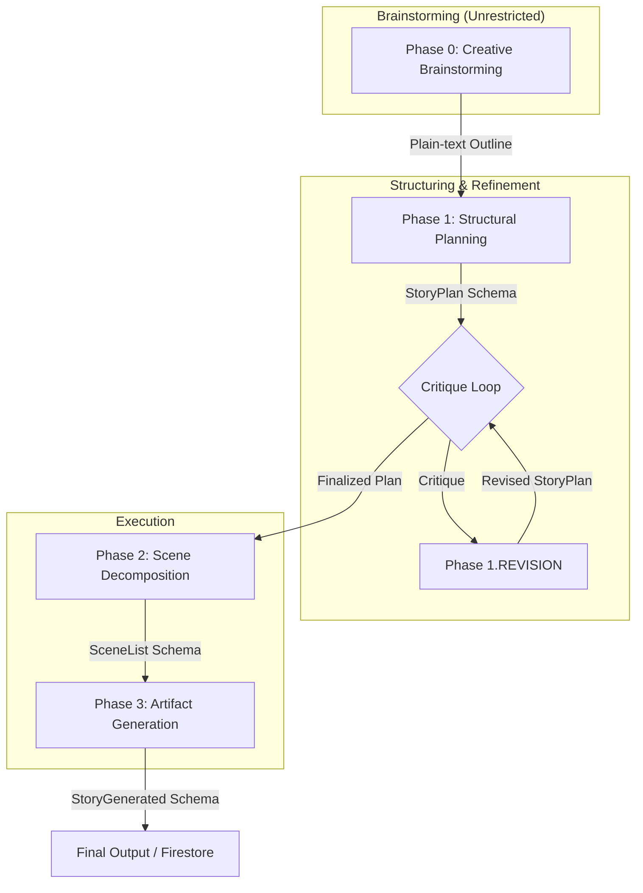

# In Real-time: Director Program

The `Director` is an agentic pipeline designed to generate massive, immersive, and "meaty" narratives for the "In Real-time" found-phone mystery game. It leverages the Gemini API to orchestrate a multi-phase creative process, ensuring high-quality storytelling with complex character arcs and realistic digital artifacts.

## Agentic Pipeline Flow

The following diagram illustrates the ML flow of the Director program:



### Phase Details

1.  **Creative Brainstorming (Phase 0)**: Gemini is given full creative freedom (high temperature, no schema) to draft a sprawling thriller outline. This captures the "big picture" and raw creative energy.
2.  **Structural Planning (Phase 1)**: The plain-text outline is mapped into a structured `StoryPlan` schema, identifying characters, lore, and act summaries.
3.  **Critique & Revision Loop**: A "ruthless editor" agent critiques the plan for consistency, pacing, and depth. The planner then revises the plan based on these actionable improvements.
4.  **Scene Decomposition (Phase 2)**: The final plan is broken down into specific "Scene Blocks" with timing offsets and expected artifacts.
5.  **Artifact Generation (Phase 3)**: The final execution writer generates deep, high-volume digital artifacts (Chat, Journal, Email, Receipt, VoiceNote) that match the scene list.

## Usage

```bash
python director.py --dry-run
```

- `--dry-run`: Generates the story and saves it to `sample_story.json` locally.
- (Default): Uploads the generated story directly to Firestore.

Intermediate snapshots are saved in the `temp_artifacts/` directory for debugging and inspection.
